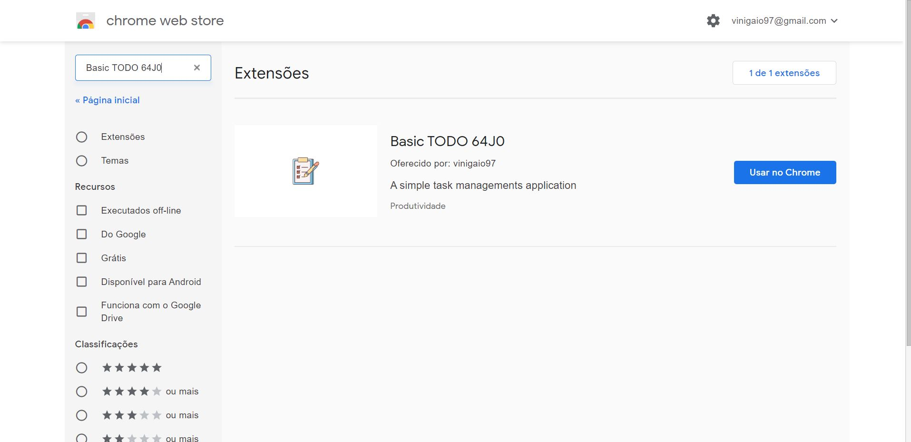

  

# A TO-DO extension for Chrome

The goal of this extension is to show a TODO popup that a user can put the tasks he/she wants to do in the day, and then, when they're completed, the user could just click in the checkbox to erase that task. **Dopamine boost**

The list os tasks are saved using the browser localStorage mechanism, so it's not shared between platforms.

_This is the first extension that I make_ :smile:

- 64J0, 2020.

---

It's 2023 and I decided to refac this code. I'm fixing some broken features, like the task counter that is presented with the extension badge, and improving the project organization.
